## Installation of Active Directory Domain Service

I'm providing you with a visual guide for installing Active Directory Domain Service. Please note that some steps may be trivial, and you can simply leave them as default and click on "Next" or "Enter".

1. 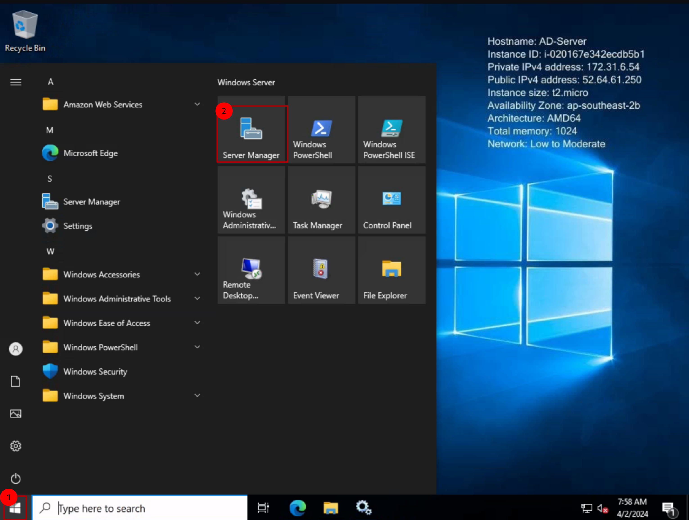
   
2. 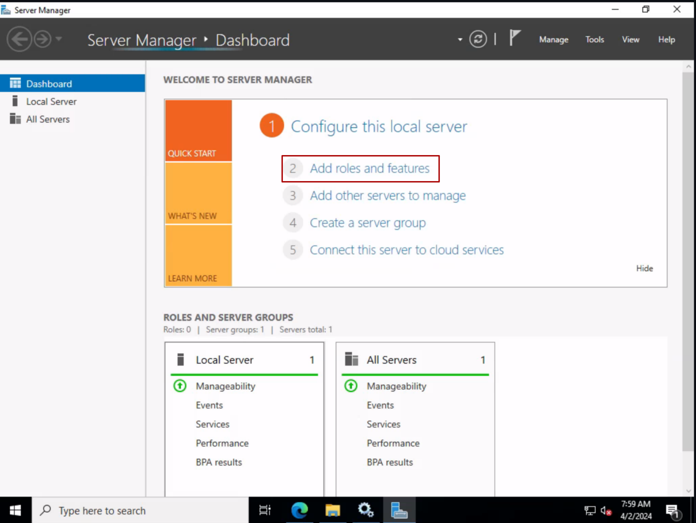

3. 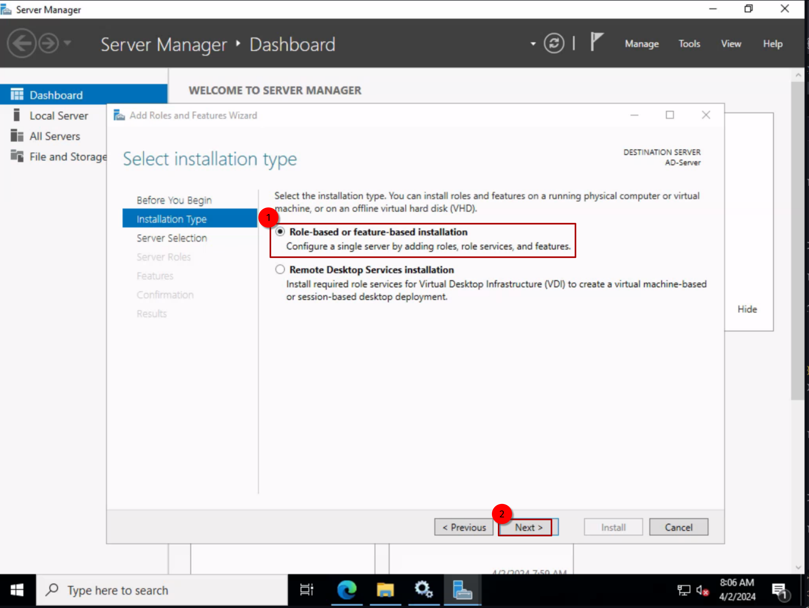

4. 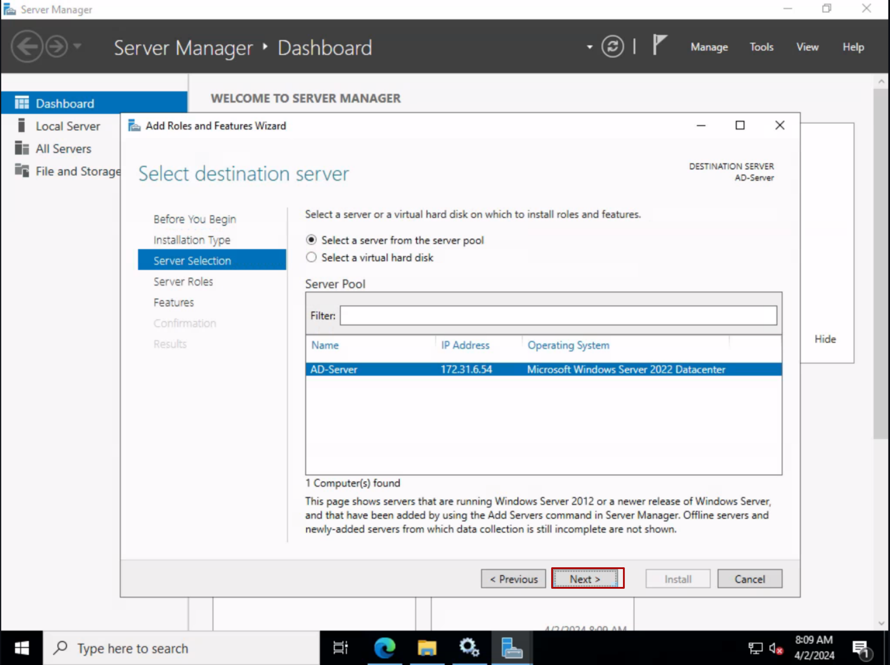

5. 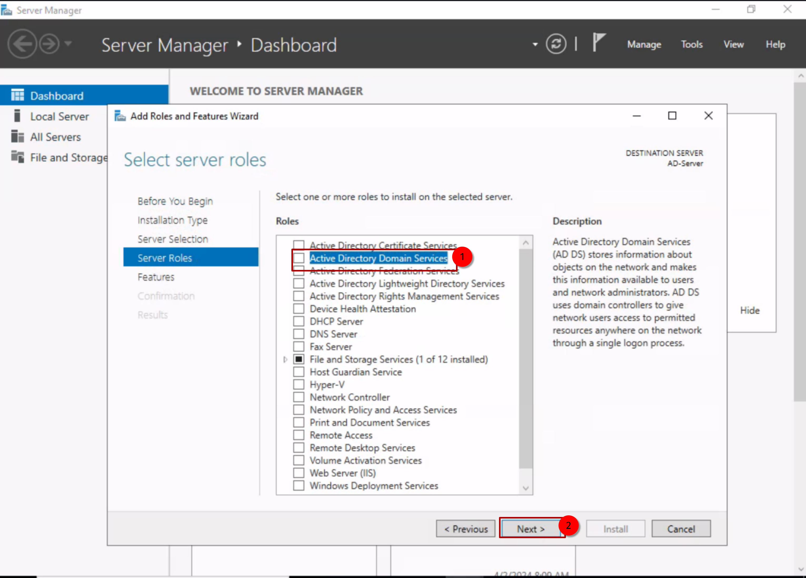

6. 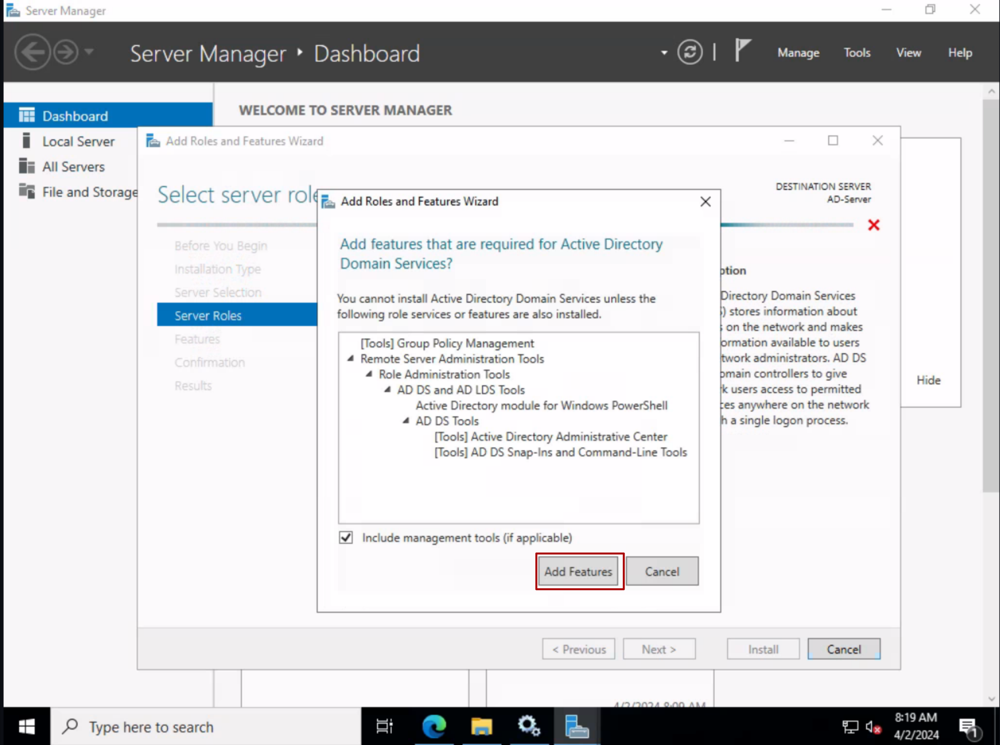

7. 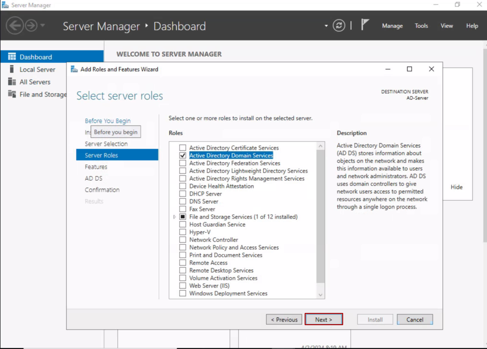

8. 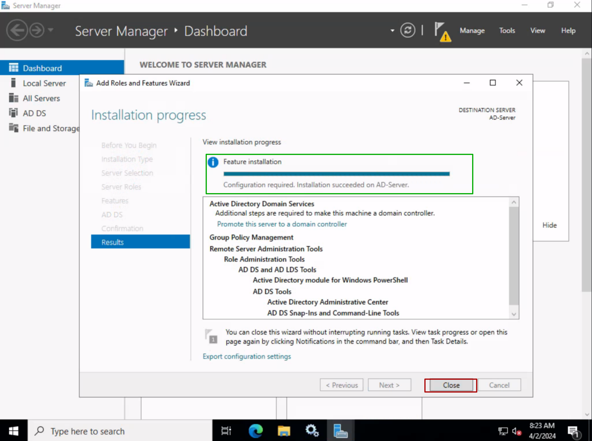

9. 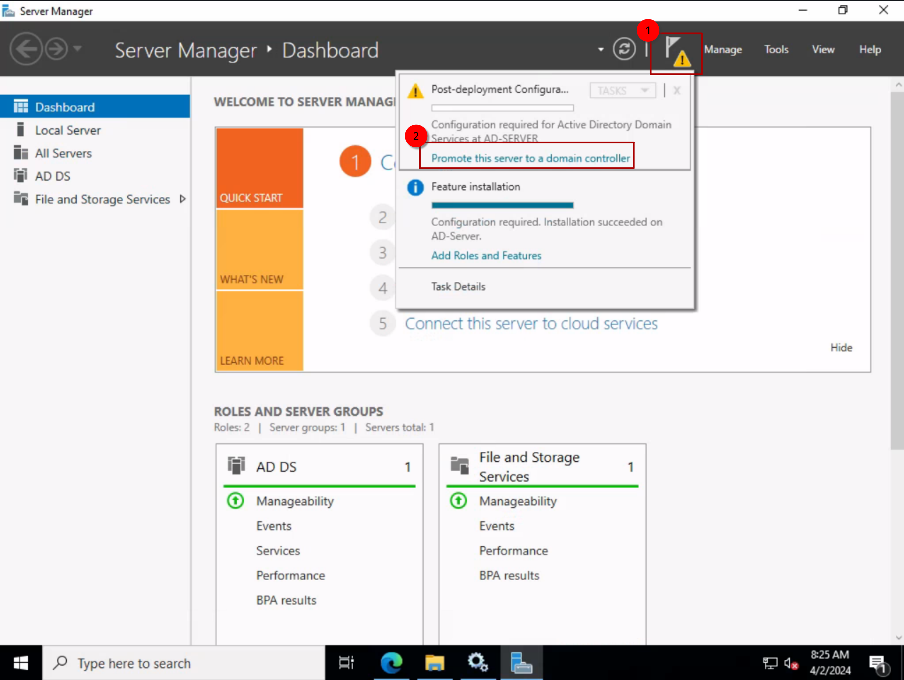

10. 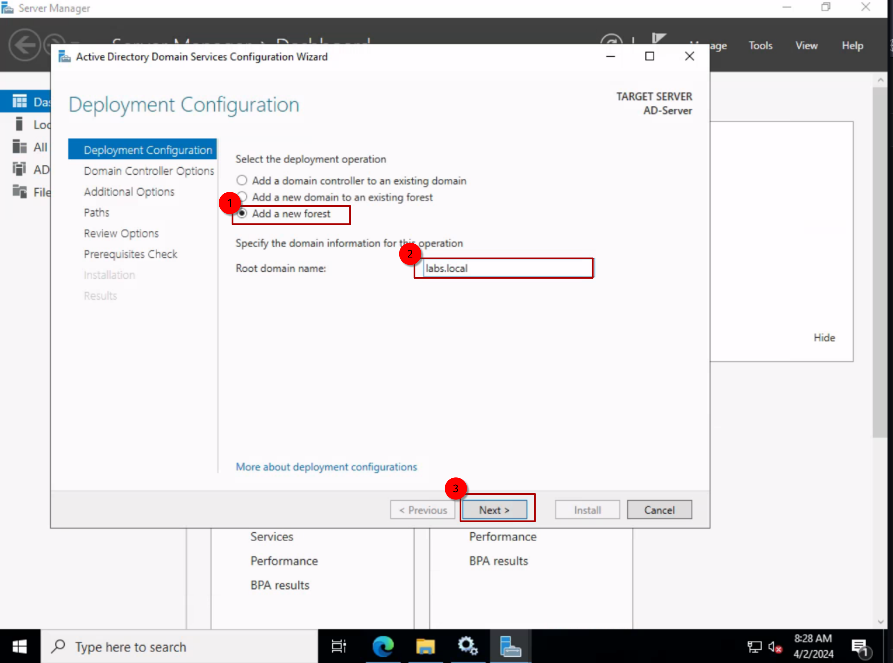

11. 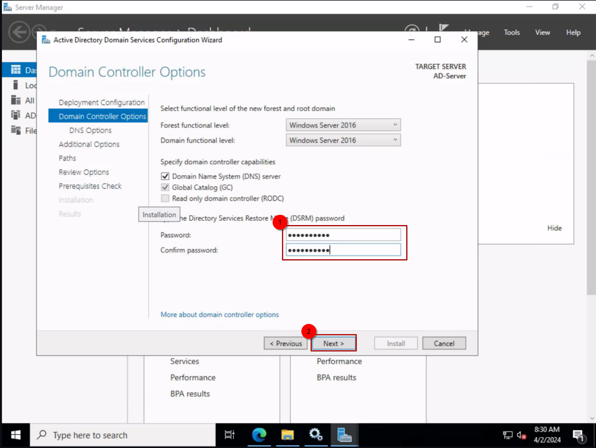

12. 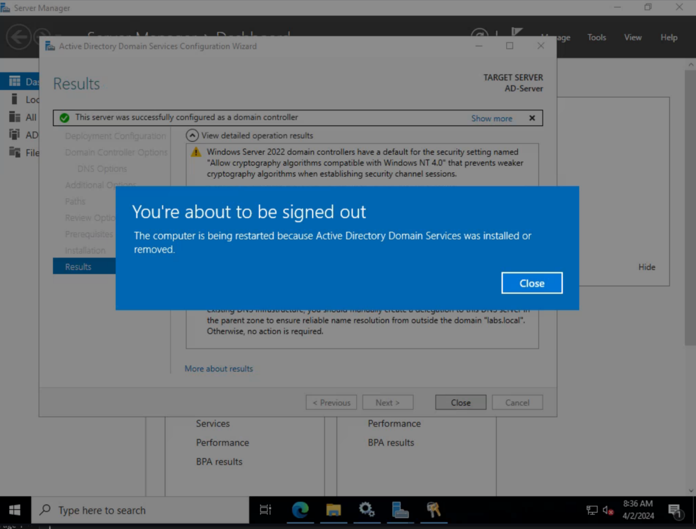

