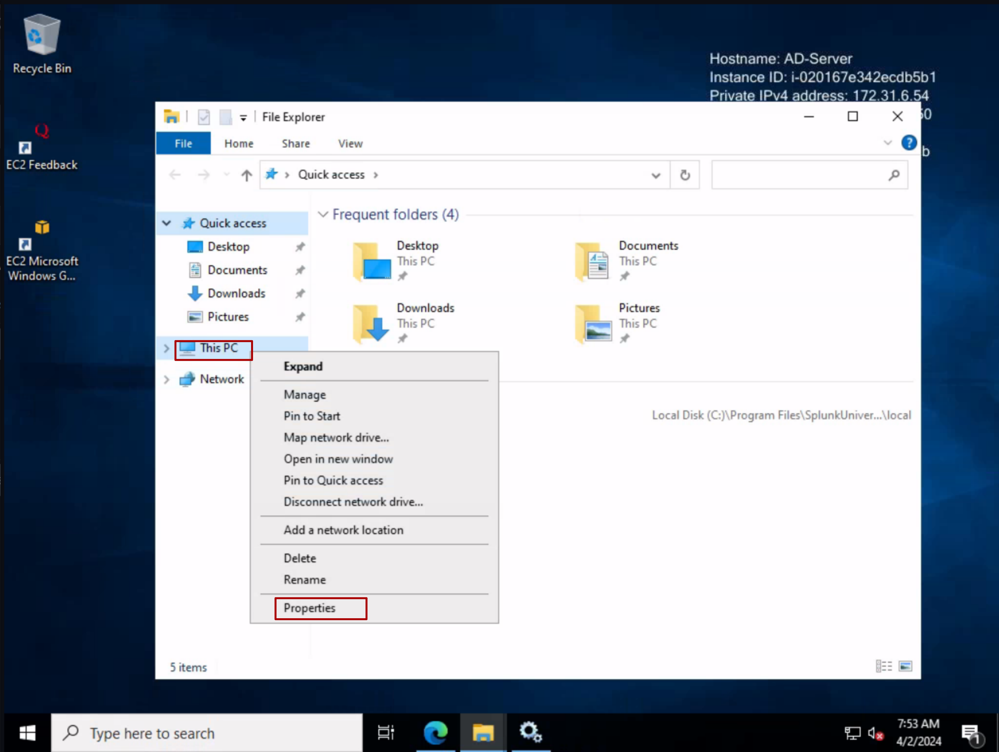
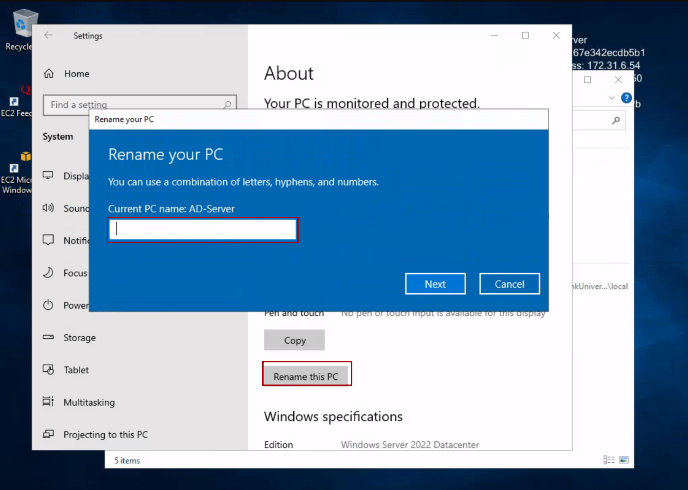
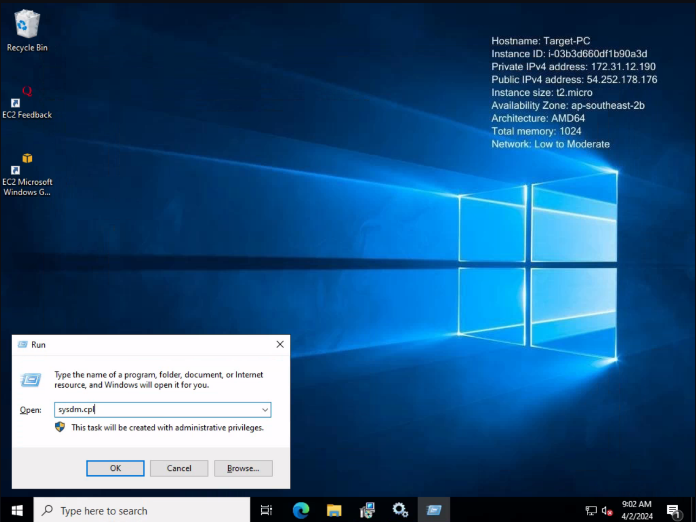
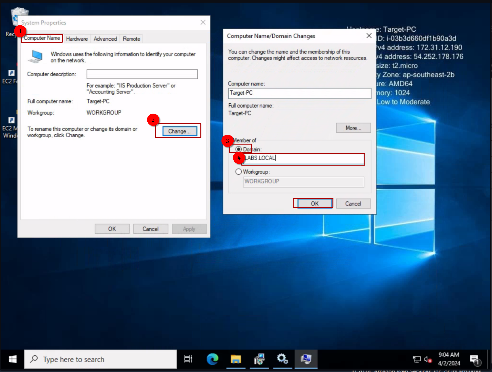
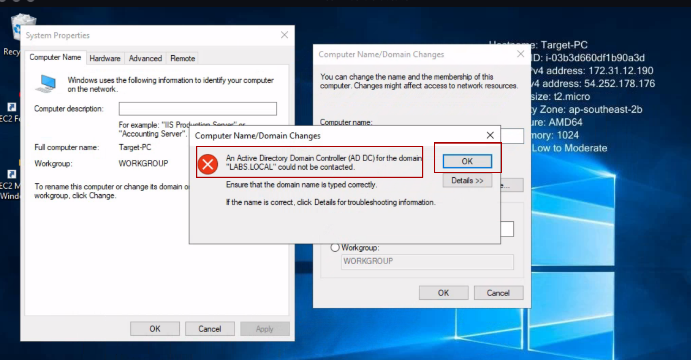

## Changing Name of Linux and Windows Instance

It is essential to have a significant or relevant name for your devices to remember and identify them easily. You can change the hostname of your device using the following steps:

- **In Linux**:
	Certainly! Here's the complete process for changing the hostname in Linux using Vim:

1. Open a terminal window on your Linux instance.

2. Type the following command and press Enter:
   ```bash
   sudo vim /etc/hostname
   ```

3. This will open the file `/etc/hostname` in the Vim text editor.

4. Press the **i** key on your keyboard to enter the **insert mode**. You will see -- INSERT -- appear at the bottom of the Vim window.

5. Use the arrow keys on your keyboard to navigate to the current hostname and edit it to your desired hostname.

6. Once you have finished editing the hostname, press the **Esc** key on your keyboard to exit the insert mode.

7. Now, type **:wq** and press Enter. This command tells Vim to save the changes and exit:
   - **:** enters command mode in Vim.
   - **w** stands for "write", which means save.
   - **q** stands for "quit", which means exit.

8. You will return to the terminal prompt, and the hostname changes will be saved.


- **In Windows**:
  Either press Win+R and type `sysdm.cpl` in the run box, then hit Enter, and change the device name, or follow the guide below:

  

  


## Joining Active Directory:

1. Press Win+R and type `sysdm.cpl`

   

2. 

3.  hnnnnnnnnnnnnnnnnnnnnnnnnnnnnnnnnn         errorrrrrrrrrrrrrrrrrrrrrrrrrrrrrrrr    !!!!!!!!!!!!!!!!!!!!!!!!!!!!!


   

Guess what, it's always DNS.

Now, if you haven't configured the security group yet, please refer to [this](aws/installation.md#Configuring-Security-Group) guide.

Let's fix the DNS issue:
- Press Win+R and type `ncpa.cpl`, then hit Enter.

- Right-click on the network adapter and select "Properties" from the context menu.

- In the adapter properties window, select "Internet Protocol Version 4 (TCP/IPv4)" and click on the "Properties" button.

- In the Internet Protocol Version 4 (TCP/IPv4) Properties window, select the option "Use the following DNS server addresses" and enter the DNS server address of your Active Directory domain controller.

   - Preferred DNS server: [Your AD DC DNS IP Address]
   - Alternate DNS server: [Leave it blank ]

- Click "OK" to save the changes and close the properties windows.

- Now, go back to the window for joining the Active Directory domain and retry the process. Enter the domain name and administrator credentials when prompted.

- If everything is configured correctly, you should be able to successfully join the Active Directory domain.

Still unable? Wait for 30 seconds and try again if still encountring the same issue flush the dns cashe:
	
To flush the DNS cache on a Windows system, you can open a Command Prompt with administrative privileges and run the following command:

```
ipconfig /flushdns
```

This command will clear the DNS resolver cache on the local system. After flushing the DNS cache, you can retry joining the Active Directory domain to see if the issue persists. If the problem persists, you may also consider restarting the DNS client service by running the following command:

```
net stop dnscache
net start dnscache
```

These steps can help ensure that any DNS-related changes or configurations take effect immediately.

Now if everything is configured correctly, you should be able to successfully join the Active Directory domain.

4.  Number two is  the prompt for administrator credentials unfortunately I forgot to take screenshot of it.

	[4](join-AD-4.png)

## Allow Remote Access (using RDP):

In the above screenshots, you will see a tab named 'Remote' at the far-right. If you want to allow RDP access to the machine for a particular account, you can set it from here.
- **Steps**:
1. Press Win+R and type `sysdm.cpl`, then hit Enter.

2. In the System Properties window, go to the 'Remote' tab.

3. Check the box that says "Allow Remote Assistance connections to this computer."

4. If you want to allow RDP access for specific users:
   - Click on the "Select Users..." button.
   - In the Remote Desktop Users dialog box, click on the "Add" button.
   - Type the name of the user or group that you want to grant RDP access to and click "OK."
   - Click "OK" again to close the Remote Desktop Users dialog box.

5. Click "Apply" and then "OK" to save the changes.

