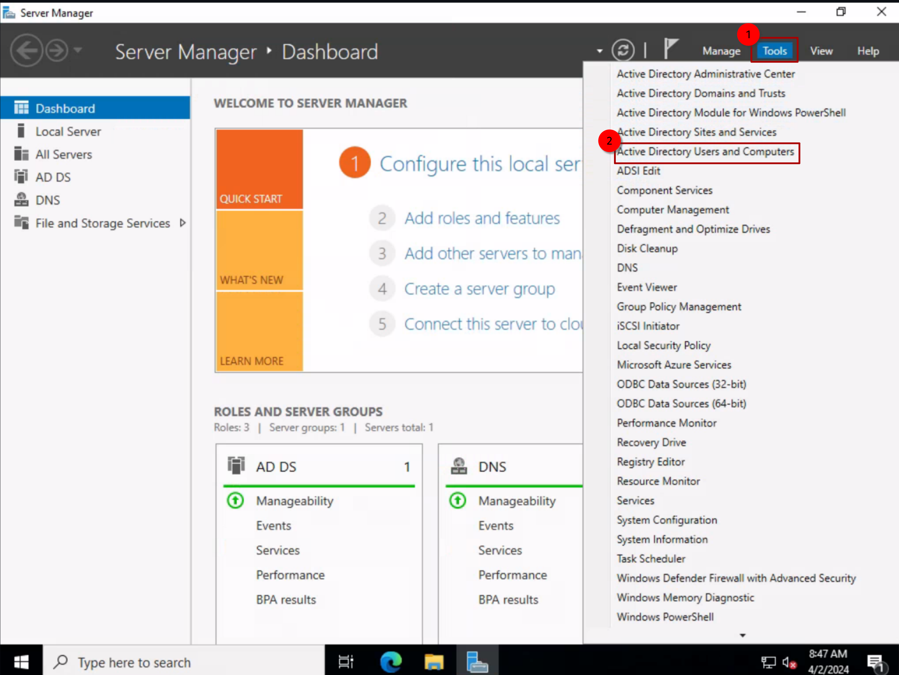

## Define Organizational Units:

While there are many effective scripts available to automate this process, since we only need one or two accounts for this project, we can manually create them quickly:

1. 

2. 

3. 

4. 

5. 

6. 

7. 