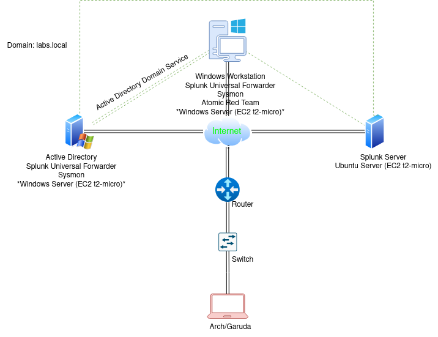

# Active Directory and Splunk Project
This project is for developing a deeper understanding of Active Directory and learning about the deployment and configuration of Splunk, as well as gaining hands-on experience with Splunk's Search and Reporting features. We will also discuss the use cases and implementation of Atomic Red Team.

## Overview

There are two ways to do this project (both are free, I will make sure you won't be charged a penny for this project). I will introduce both, but discuss only one because the steps are identical for both methods.

The first way to do it is to set up a local lab environment using your own hardware and Virtual Machines. You can use VMWare or VirtualBox, whichever you prefer. The approximate requirements for this setup will be 250 GB of free space and 16 GB of RAM. Processors with higher cores are a plus. Your setup will look something like this:

The second way is using the cloud, and I will discuss this method because many people don't have the privilege of using high-performance PCs and laptops. So, using cloud-based machines is a very optimal choice for them. Also, you will get some idea about deployment of instances over the cloud. I'm using AWS for this project because it's free for newcomers and easy to use. As promised, this project won't cost you a single penny, so we will only use t2.micro instances for this. Though we will face some performance issues, I will tell you how to tackle them. If you are familiar with any other cloud service provider, you can use any cloud platform of your choice. There is no restriction to use AWS only. The general representation of our setup will look something like this:

Note: I'm using a Linux-based operating system. However, if you use Windows as your main operating system and are not familiar with Kali, Arch, Garuda, BlackArch, or Parrot, don't worry. I will use tools for demonstration that work for both Windows and Linux. So there is no need to install Linux OS, Windows will work fine.

Now, before defining things, I will request you to register for an account in Splunk, as they may take up to 24 hours to send you the account confirmation email. So, before starting anything, register an account at [Splunk](https://idp.login.splunk.com/signin/register).

Also, set up an account on [AWS](https://aws.amazon.com/resources/create-account/) or download and install [Oracle VM VirtualBox](https://www.oracle.com/virtualization/technologies/vm/downloads/virtualbox-downloads.html) or [VMware Workstation Player](https://www.vmware.com/products/workstation-player.html).

Let's talk about tools used in this project:

1. **Splunk Server**:
    Splunk Server is a robust platform designed for indexing, searching, and correlating machine-generated data in real-time. It can collect data from diverse sources such as logs, events, metrics, and other forms of machine data. Splunk Server provides powerful search capabilities, visualization tools, and alerting mechanisms, making it invaluable for gaining insights into system performance, security incidents, and operational trends.

2. **Splunk Universal Forwarder**:
    Splunk Universal Forwarder is a lightweight component that efficiently collects and forwards data from remote sources to a centralized Splunk instance i.e., Splunk Server. It consumes minimal system resources and can be deployed across distributed environments to gather data from various endpoints, devices, and applications. Splunk Universal Forwarder ensures seamless data transmission, enabling organizations to monitor and analyze data in real-time without overwhelming network bandwidth or server/source resources.

3. **Sysmon**:
    Sysmon is a powerful system monitoring tool developed by Microsoft Sysinternals. It operates as a Windows service and device driver, capturing detailed information about system activity and events. Sysmon logs various types of data, including process creations, network connections, file modifications, and registry changes. It provides valuable insights into system behavior, aids in forensic investigations, and enhances security by detecting suspicious or malicious activities on Windows-based systems.

4. **Active Directory**:
    Active Directory (AD) is a directory service provided by Microsoft Windows Server. It centralizes authentication, authorization, and management of network resources within an organization. Active Directory stores information about users, computers, groups, and other network objects in a hierarchical database called the Active Directory Domain Services (AD DS). It facilitates single sign-on, group policy management, and directory-based access control, making it essential for maintaining security and scalability in Windows-based environments.

5. **Atomic Red Team**:
    Atomic Red Team is a framework developed by Red Canary for testing and validating endpoint detection and response (EDR) solutions. It consists of a library of small, highly targeted tests, known as "atomic tests," that simulate real-world attack techniques and behaviors. Atomic Red Team helps organizations assess the effectiveness of their security controls, detect gaps in detection and response capabilities, and improve overall security posture by emulating adversary tactics in a controlled environment.

6. **thc-hydra**:
    thc-hydra is a versatile and powerful password-cracking tool used for performing brute-force attacks against various network protocols and services. It supports a wide range of authentication mechanisms, including HTTP, FTP, SMB, SSH, Telnet, and more. thc-hydra can be customized to conduct dictionary-based attacks, hybrid attacks, and other password-cracking techniques, enabling security professionals to assess the strength of passwords and evaluate the security of networked systems.

Additionally I want to discuss Organizational Units:

**Organizational Units**: Organizational Units (OUs) in Active Directory are containers used to organize and manage objects such as users, groups, computers, and other OUs within a domain. They provide a hierarchical structure that reflects the organization's structure, making it easier to manage resources and apply policies. In simple terms, if we have four departments in our company/organization, we can create four OUs. This will help us manage users within their respective units and implement policies, as well as assign permissions and resources accordingly.

## Environment Setup
- **Required Instances**: 2 Windows Server and 1 Ubuntu Server t2.micro instances on AWS. One of the Windows servers will be used as "Target-PC" (since regular Windows instances are not available, we will use Windows Server instead).
- **Local Operating System**: Windows Workstation or any Linux OS.
- **Security Monitoring**: We will install `Sysmon` on both of the Windows instances for detailed system activity logging.
- **Log Forwarding**: We will install `Splunk Universal Forwarder` on both of the Windows instances for log forwarding.
- **Log Analysis**: We will utilize `Ubuntu Server` to host `Splunk Server`.
- **Active Directory**: One of the Windows servers will serve as our Active Directory domain controller. We will install and 								configure Active Directory Domain Services on this server.
- **EDR Testing**: We will conduct Endpoint Detection and Response (EDR) testing by installing `Atomic Red Team` on a Windows 						   instance. This will allow us to evaluate the effectiveness of our `Splunk` setup. 

## Installation

- **t2.micro Instances**: [Here](aws/installation.md) is the guide for installation of Windows and Ubuntu Server  over AWS, to
install locally on Virtual Machine  and follow the same project there is an awesome video guide over Youtube by [MyDFIR](https://www.youtube.com/@MyDFIR), show him some love. 

Note: Check [this](aws/installation.md#Configuring-Security-Group) step even if you know how to launch instances because it is crucial for connectivity between instances as well as between instances and your local machine.

- **Splunk Enterprise**: [Here](splunk_server/installation.md) is the guide for `Splunk Server` installation.
- **Splunk Universal Forwarder**: [Here](splunk_forwarder/installation.md) is the guide for `Splunk Universal Forwarder` installation.
- **Sysmon**: [Here](sysmon/installation.md) is the guide for `sysmon` installation.
- **Active Directory Domain Service**: [Here](ADDS/installation.md) is the installation and configuration guide for AD DS.
- **Joining Windows to Active Directory**:[Here](AD_join/join.md) is the guide for joining Windows to Active Directory.
You can configure organizational units and add users to them by following [this guide](OU/conf.md).
- **Setting Up Organizational Units**: [Here](OU/conf.md) is the guide for configuring Organizational units and adding user to them.
- **Installation of Hydra**:[Here](hydra/installation.md) is the installation guide for thc-hydra.
- **Installation of Atomic Red Team**:[Here](atomic/installation.md) is the installation guide for Atomic Red Team.

## Usage
 Once everything Installed we will  refer to the [Usage Guide](/docs/usage.md).

## Acknowledgments:

I would like to express my gratitude to the creators and developers of the tools and scripts used in this project. Without their dedication and innovation, such advancements in cybersecurity would not be possible. 

A special thanks to the [MyDFIR](https://www.youtube.com/@MyDFIR), for his valuable contribution without his help it wouldn't have been possible to complete this project.