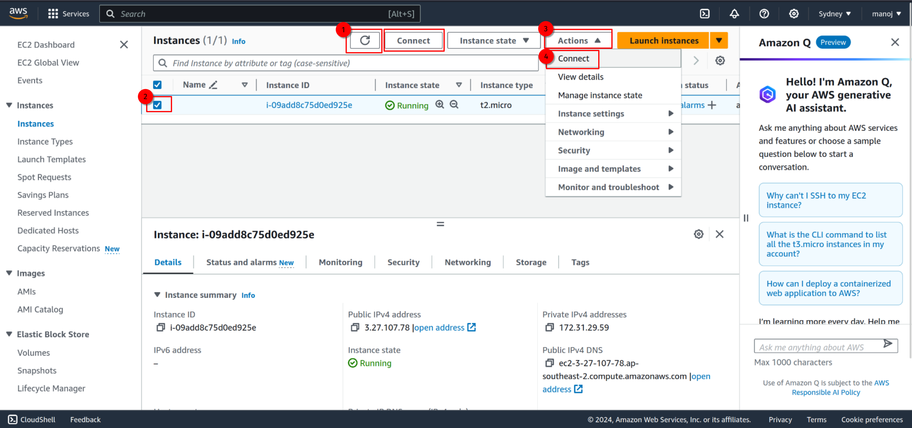
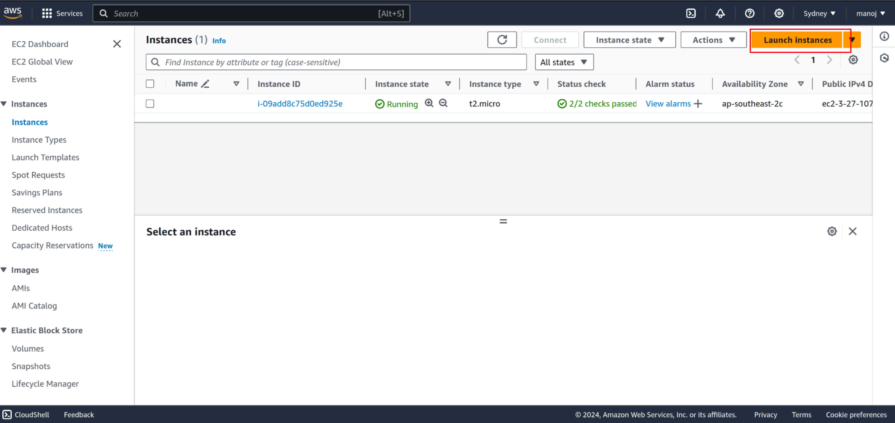

## Launching an Instance {# Launching-an-Instance}

Let's first launch an Ubuntu t2.micro instance and then discuss how to access it.

1. [Login](https://console.aws.amazon.com/console/home?nc2=h_ct&src=header-signin) to your AWS account and navigate to "Instances." Then, click on "Launch Instances":

   

2. Select an instance type. For this demo, we are launching an Ubuntu server, so select "Ubuntu":

   

3. Choose a key pair. If it's your first time or you want to use a new key pair, create a new key pair and save it in a secure location as we'll need it later:

   

4. Scroll down and click on "Launch Instance":

   

5. Now, either click on "Connect to instance" or "View all instances." Since it takes around 1-2 minutes for the instance to launch, connecting to it won't be possible immediately. Therefore, clicking on "View all instances" is recommended:

   

6. You may not see any running instances in this window initially. Simply click on the refresh button, and the launched instance will appear. Select it, and if it's running, either click on "Connect" or go to "Actions" -> "Connect":

   

7. We can directly connect to Ubuntu instances from the web console by clicking on "Connect." However, if you prefer connecting using SSH, it's also straightforward. For Linux systems, you can use the SSH client. For Windows, follow these steps:

   1. **Download PuTTY and PuTTYgen**:
      - If you haven't already, download PuTTY and PuTTYgen from the official website: [PuTTY Download Page](https://www.putty.org/).
      - PuTTY is the SSH client, and PuTTYgen is a tool for generating and converting SSH keys.
   
   2. **Convert .pem to .ppk using PuTTYgen**:
      - Open PuTTYgen.
      - Click on "Load" and select your .pem file.
      - PuTTYgen will automatically detect the key type and will prompt you to save the private key.
      - Click on "Save private key" to save the private key in PuTTY's .ppk format.
   
   3. **Configure PuTTY**:
      - Open PuTTY.
      - In the PuTTY Configuration window, enter the hostname or IP address of your AWS EC2 instance.
      - Go to the "Connection" > "SSH" > "Auth" section.
      - Click on "Browse" and select the private key (.ppk) file you saved in the previous step.
      - Go back to the "Session" category, enter a name for your session in the "Saved Sessions" field, and click "Save" to save your settings.
   
   4. **Connect to AWS EC2 Instance**:
      - Click "Open" to start the SSH session.
      - If this is the first time you are connecting to the instance, PuTTY will ask you to confirm the server's host key.
      - Once connected, you should be prompted to enter the username for your AWS EC2 instance (e.g., `ec2-user`, `ubuntu`, `admin`, etc.). The specific username depends on the AMI (Amazon Machine Image) you are using.

   

8. Now you are connected! 

   

## Connectivity {#Connectivity}

Ensuring connectivity among your instances is crucial. You need to enable communication between them and ensure you can reach them from your local machine, and vice versa. For this, you'll need to define some inbound and outbound rules in the security group settings. It's important to note that what I'm showcasing here is not a recommended practice in a production environment or for personal use. However, since we are using these instances for practice purposes only, we can relax some rules (wink wink. 

Ideally, you should define rules specific to your IP addresses and allow only required ports. However, in this lab environment, we are allowing all inbound and outbound traffic. It's important to remember not to use this security group for any other instances other than those used in this lab.

We will define one security group and use it for all the instances involved in this project.

It's important to note that while in general, static IP addresses are preferred for such setups, we are using free t2.micro instances. Once these instances are released, there is no way to retrieve the data or regain the same IP address. Therefore, it's crucial not to shut down or terminate the instances until we are done with the project.

Now let's configure our security group:

## Configuring Security Group {#Configuring-Security-Group}

1. Select or tick the instance name, and when you scroll towards the right in the Instances page, you will see the security group name currently used for your first launched instance. Scroll down and select "Security":

   

2. In the Security tab, scroll down, and you will see "Inbound" and "Outbound" rules. In any of them, scroll towards the right, and you will see the name of the security group. Click on it:

   

3. Now, select the instance, and a menu will appear. Select "Inbound rules" (the same will apply for Outbound rules) and click on "Edit inbound rules":

   

4. Click on "Add rule," and now you can define a rule according to your requirements. For this lab, we are allowing all inbound TCP and UDP traffic. Select 'ALL TCP' in Type and 'Anywhere-IPv4' in Source, and similarly for UDP. Save the rule.

   

Note: you can also define and configure the security group from EC2 dashboard.

Now in same manner define outbound rules.

Now let's define another instance (Windows Server) and we will use the above defined security group for that instance so we dont have to define security groups for all the instances separately.

## Launching Windows Instance {#Launching-Windows-Instance}

1. In the Instances page, click on "Launch Instances":

	

2. Select the instance type:

	

3. Select or generate a new key pair:

	

4. Now, in the Firewall (security groups) section, select the existing group and choose our recently defined security group from the drop-down menu:

	

5. Scroll down and click on "Launch Instance":

	

6. Go back to the instances page, refresh it by clicking on the refresh icon/symbol, and wait for the instance to get completely loaded. Once it shows "running," select it and click on "Connect":

	

7. Since we can't connect directly to Windows instances, select "RDP Client" and then download the remote desktop file or use the password to connect to the instance by clicking on "Get password":

	

8. Upload your private key you saved previously and decrypt the password:

	

9. Finally, connect to the remote instance using an RDP client like xfreerdp or remmina in Linux, and for Windows, use the built-in Remote Desktop Connection (RDC) client.
	 `xfreerdp /v:IP_or_domain /u:user_name /p:password +clipboard` 
	

## Terminate or Shutdown {#Terminate-or-Shutdown}

When you are done with your project, please don't forget to terminate or shut down the instances. Otherwise, they will run indefinitely, and your free hours will be exhausted, leading to charges.

