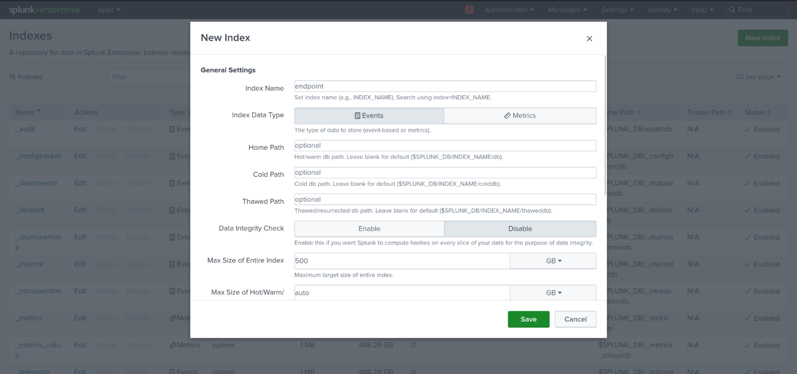

If you have configured everything and cleared all the errors and difficulties, now it's time to perform some hands-on tasks over the Splunk dashboard. But before that, I want to discuss some points which I didn't mention earlier to avoid confusion:

1. We haven't yet told the Splunk server which port to listen to for incoming logs.
2. In the `inputs.conf` file, I wrote `index = labs`, which is not the default index in Splunk. Although we can use `_main` as the index as it is the default index in Splunk, the idea here is to learn how to define a custom index.

When you log in to your Splunk instance, you will be presented with the following webpage:


Now let's configure receiving:

## Configure Receiving:
1. Click on "Settings" at the top right corner, then a dropdown will appear. Click on "Forwarding and Receiving".

    

2. Click on "Configure receiving".

    

3. Add the default port that we set on Splunk Universal Forwarder.

    

Now, let's configure the indexes.

## Configuring Indexes:

1. 

2. Click on "New Index".

    

3. Since we are using "labs" as an index name, create an index with the name 'labs'.

    

It's time to check our index:

- Click on "Search and Reporting".

    

- Choose the appropriate time interval and search `index="labs"`.

    

Now, we will attempt to access the "target-pc" using Hydra. For this, create a small password list of 10 to 30 passwords and add the actual password at the end so we get a successful attempt.

In the GUI-based Hydra, fill the input fields, and for the CLI, here is the command:

```
hydra -l username -P /path/to/wordlist.txt rdp://ip/of/target/PC
```

Go back to Splunk Search and type `index=labs username`, you will get some events.


Scroll down in Interesting Fields, and you will find a field named EventCode with two codes we are interested in:

- **4624 - Successful Logon**: This event is generated when a user successfully logs on to a Windows system.
- **4625 - Failed Logon**: This event is generated when a logon attempt fails on a Windows system. In the below screenshot, there are exactly 29 failed logon attempts because I was using a wordlist of 30 passwords, and the 30th password was the correct one.

    

And I have exactly one event for a successful logon.

   


## Test Splunk using Atomic Red Team:

In the Atomic Red Team base directory, there are various techniques provided to simulate adversarial behaviors and assess the detection capabilities of Splunk. One such technique we will employ for demonstration purposes is T1136.001.

**T1136.001 - Create Account:**

This technique involves creating a new local user account on a system. The purpose of this technique is to test if Splunk can detect such activities, which might indicate unauthorized access or malicious activity.

To execute this technique, navigate to the Atomic Red Team base directory and locate the appropriate script or command to create a new local user account. Execute the script or command, and observe the system for any relevant activities.

After performing the technique, you can search within Splunk for any related events or logs. Specifically, you can search for activities related to the creation of new local user accounts, such as user creation events or changes to the local user database.


Once the technique has been executed and relevant events have been generated, you can analyze the results within Splunk to assess its detection capabilities and ensure that it can effectively identify and alert on such activities.

Don't limit yourself you cando lot more from here but writting all the steps and all take to much time so I'm ending this project here but for you sky is the limit  


## Ending Note:

As we conclude this project, we hope it has been an insightful journey into understanding Active Directory, Splunk deployment, and the use of various security tools. Remember, the knowledge gained here is just the beginning of your exploration in cybersecurity.

Whether you're a beginner or an experienced professional, continuous learning and experimentation are key to staying ahead in this ever-evolving field. Keep exploring, keep experimenting, and never stop learning. This is the way <3.
