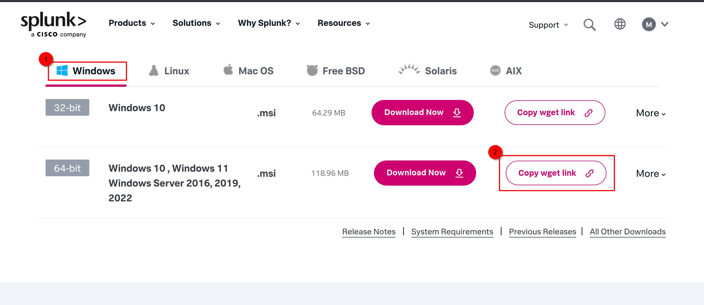
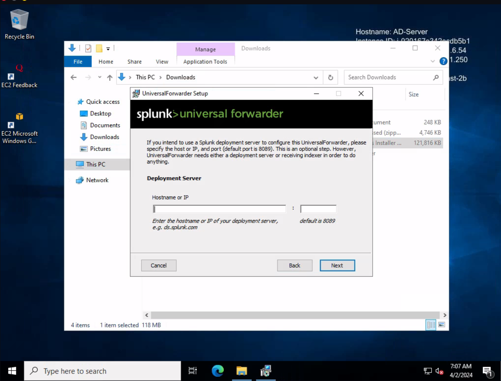
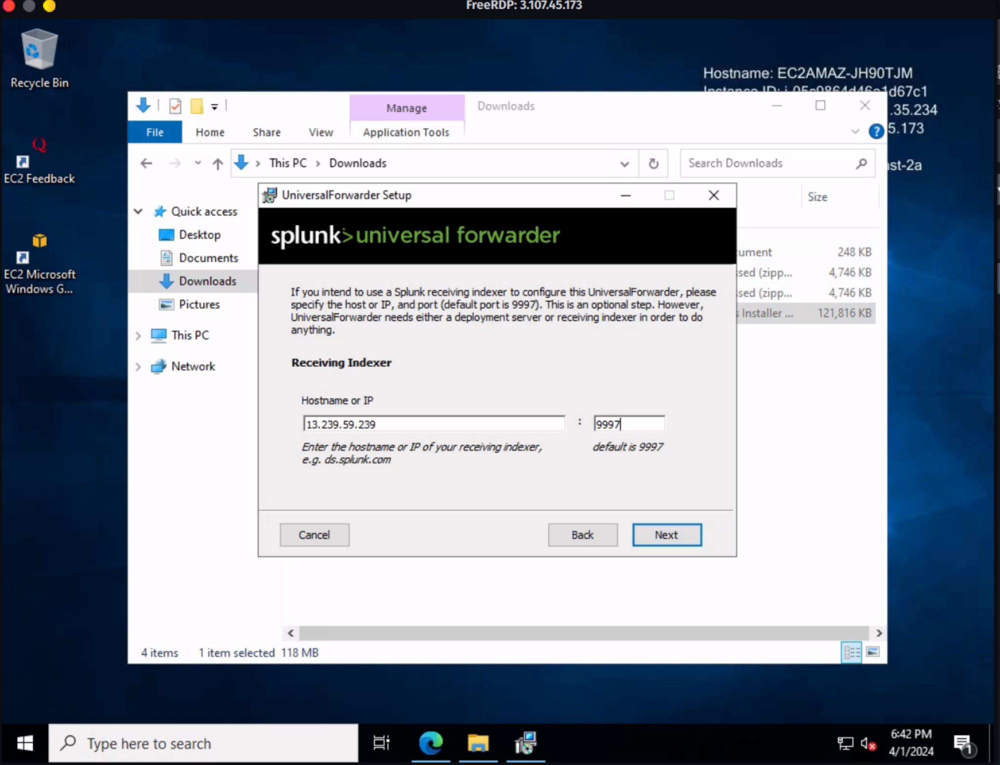

## Installation of Universal Splunk Forwarder

1. Login to Splunk (assuming you have already set up your account).

2. Go to [Free trials & downloads](https://www.splunk.com/en_us/download.html).

3. Select Splunk Universal Forwarder and click on [Get my free trial](https://www.splunk.com/en_us/download/universal-forwarder.html).

4. Choose your Installation package, in this case, Windows, and copy the download link for the 64-bit package:
   
   

5. Since `wget` is not a default package in Windows and `curl` might cause some issues, paste the download link in a text editor like Notepad and copy only the part of the link starting with "https://download.splunk.com/products/universalforwarder/releases/9.2.1/...". Paste this modified link into your web browser's address bar and hit enter to download the Splunk Forwarder.

6. Navigate to the downloaded folder and double click on the downloaded file to start the installation process.

7. During the installation process, when prompted for the deployment server, leave it blank and click "Next".

   

8. In the "Receiving Indexer" section, enter the IP address of the Splunk server (public IP address of the Ubuntu server) and use the default port (9997).

   

