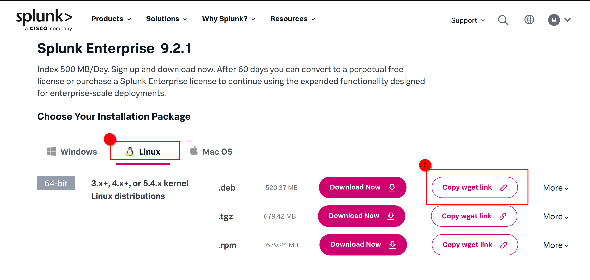
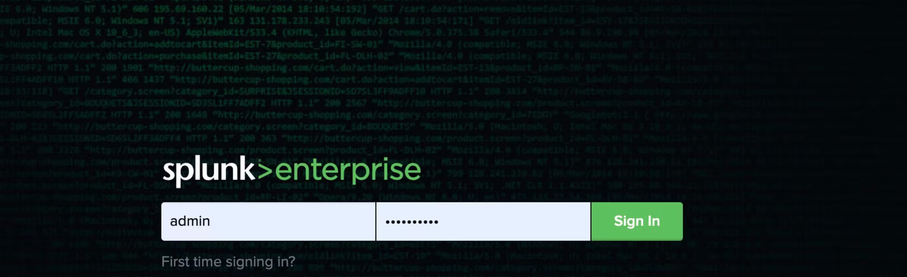

## Installation of Splunk Enterprise {#Installation-of-Splunk-Enterprise}

1. Login to Splunk (assuming you have already set up your account).

2. Go to [Free trials & downloads](https://www.splunk.com/en_us/download.html).

3. Select Splunk Enterprise and click on [Get my free trial](https://www.splunk.com/en_us/download/splunk-enterprise.html).

4. Choose your Installation package, in this case, Linux, and copy the wget link for the .deb package:
   
   

5. Paste the link in your Ubuntu server's terminal and hit enter. Splunk server will be downloaded shortly.

6. Navigate to the downloaded folder and run the following command to install Splunk:

   ```bash
   sudo dpkg -i PACKAGE_NAME.deb
   ```

   Example: 
   ```bash
   sudo dpkg -i splunk-9.2.1-78803f08aabb-linux-2.6-amd64.deb
   ```

7. Change directory to /opt/splunk/bin and switch to the `splunk` user's bash shell:

   ```bash
   cd /opt/splunk/bin
   sudo -u splunk bash
   ```

8. Start the Splunk server:

   ```bash
   ./splunk start
   ```

9. Create a user account (remember the password for later use in logging into the Splunk webapp). 


10. There is a limit of 5000MB on storage, and if we reach this limit, Splunk will not parse the logs. As we are using a very basic low-storage t2.micro instance, we need to lower this limit to avoid warnings and errors in the future. Run the following commands:

    ```bash
    sudo ./splunk set minfreemb 200
    sudo ./splunk restart
    ```

By running these commands, you will adjust the minimum free storage limit to 200MB and restart Splunk to apply the changes.

11. Now, exit the shell:

   ```bash
   exit
   ```

   Then, enable the service so that it restarts automatically at boot:

   ```bash
   sudo ./splunk enable boot-start -user splunk
   ```

12. To check whether your Splunk server is running, navigate to http://public-ip-address-of-your-ubuntu-instance:8000 in your browser and enter the credentials you created during installation.

   

