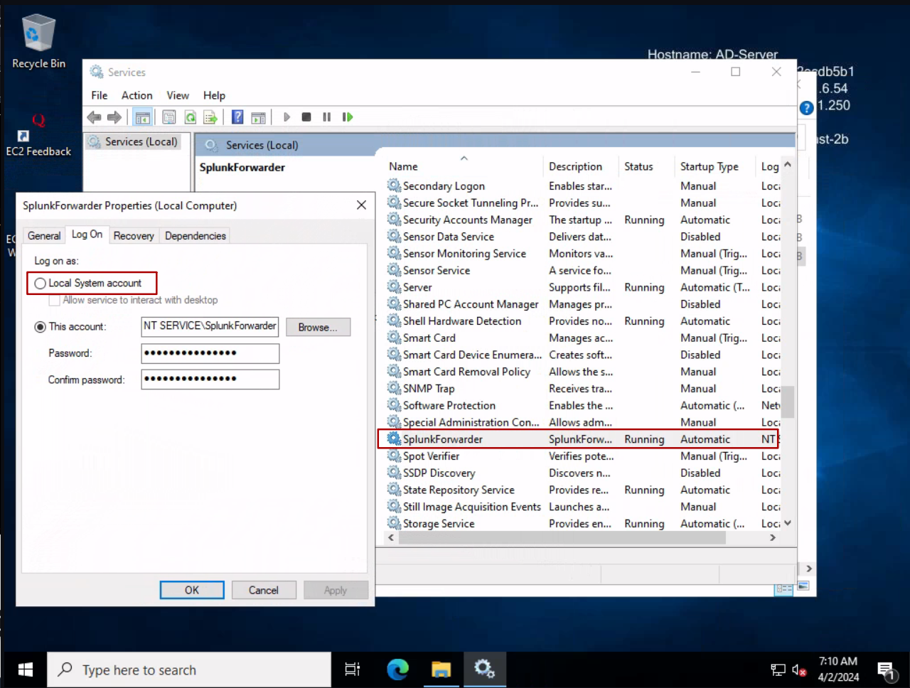
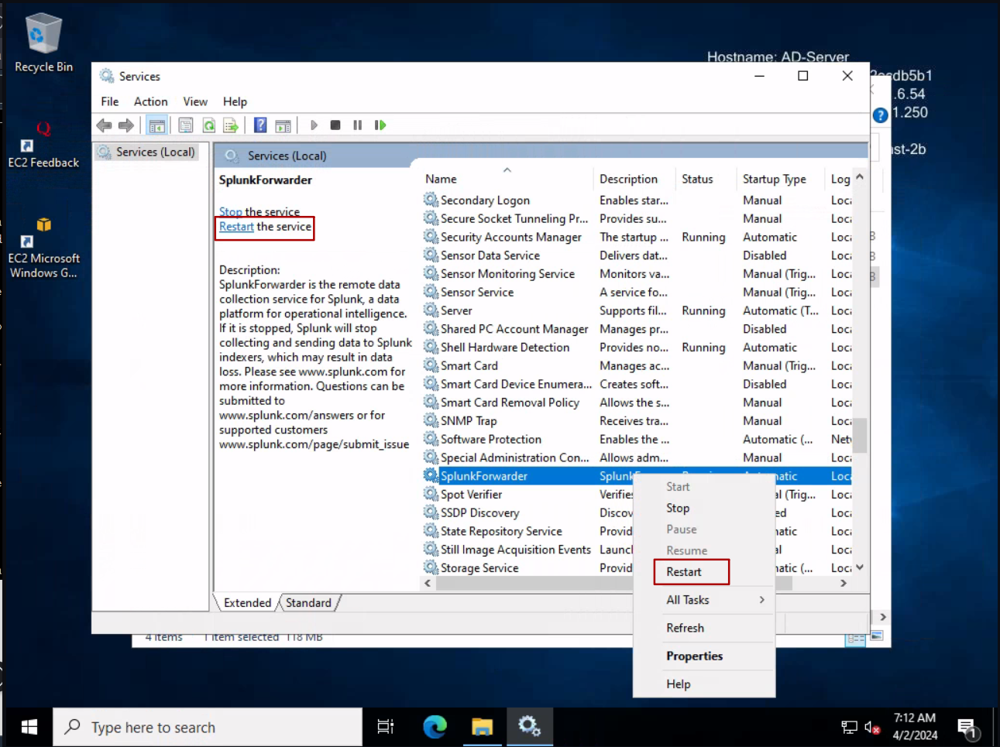

## Sysmon Installation {#sysmon-installation}

1. Download and Install Sysmon from [here](https://learn.microsoft.com/en-us/sysinternals/downloads/sysmon).

2. Download the configuration file from [here](https://github.com/olafhartong/sysmon-modular/blob/master/sysmonconfig.xml).

3. Extract Sysmon and open PowerShell. Navigate to the directory where sysmon64.exe is located:

   ```powershell
   cd C:\User\Administrator\Downloads\Sysmon
   ```

   Then, install Sysmon using the provided configuration file:

   ```powershell
   .\sysmon64.exe -i ..\sysmonconfig.xml
   ```

4. Now navigate to `This PC` -> `C:` -> `Program Files` -> `SplunkUniversalForwarder` -> `etc` -> `system` -> `local` and create a file named `inputs.conf`. Ensure that your file explorer is set to show file extensions, as creating a new text file without this setting may result in the file being named `inputs.conf.txt`. You can access the content to be added to `inputs.conf` from [here](docs/inputs.conf). Simply copy and paste this content into the newly created `inputs.conf` file.

5. Press the Windows/meta key and type "services" in the search bar. Run the Services app as an Administrator. Scroll down or type quickly to find the Splunk Forwarder service. Right-click on it and select "Properties". Go to the "Log On" tab and select "Local System Account" to ensure Splunk can forward all the logs. Click "OK".

   

6. Restart the Splunk Forwarder service.

   

With these steps, both Sysmon and the Splunk Forwarder are now completely configured as per our requirements.
